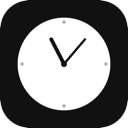

<p align="center">
  
</p>

<h1 align="center">Cawernda</h1>

<p align="center">
  <strong>A minimalist, natural language-powered reminder app for macOS</strong>
</p>

<p align="center">
  
  
</p>

---

## What Cawernda does

Cawernda keeps time-sensitive work visible without becoming a project-management system. It is designed for renewals, follow-ups, operational deadlines, and anything else that should not fall through the cracks.

- **Fast capture:** press `⌘⇧Space`, type or paste a reminder, and press `⌘↩`.
- **Natural time tokens:** use `@5m`, `@2h`, or combinations such as `@1h30m`.
- **Nested checklists:** paste bullets, numbered lists, or Markdown checkboxes beneath a title.
- **Upcoming view:** active reminders are grouped into Overdue, Today, Next 7 Days, and Later.
- **History:** completed and dismissed reminders remain available until explicitly deleted.
- **Reuse:** recreate a historical reminder with a new date while preserving the original record.
- **Alarm sounds:** choose No Sound, one of three bundled defaults, or a locally installed MP3; acknowledgement stops playback.
- **Reminder reviews:** optionally show the full-screen active-reminder summary every three or six hours, including after wake.
- **Local-first:** reminders and preferences stay in macOS `UserDefaults`; there is no account or cloud service.

## Create a reminder

Plain reminder:

```text
Renew production certificate @2h
```

Reminder with a checklist:

```markdown
### Job Applications
- [ ] Review suggested roles
- [ ] Identify suitable roles
- [ ] Apply for selected roles
- [ ] Record submitted applications
```

Choose an exact date in the capture window, use **In 1 hour** or **Tomorrow**, or let the configurable default duration apply.

## Reminder lifecycle

1. New reminders appear under **Active**.
2. When due, Cawernda shows an actionable popup or a native macOS notification.
3. **Done** moves the reminder to History; **Snooze** or **Still Running** schedules it again.
4. History supports individual deletion, bulk deletion, and reuse with a new date.

## Keyboard shortcuts

| Shortcut | Action |
| --- | --- |
| `⌘⇧Space` | Open reminder capture |
| `⌘↩` | Save the reminder |
| `Esc` | Close capture or dismiss the startup review |
| `⌘,` | Open Settings |

## Local application bundle

```bash
bash package_local.sh
open artifacts/Cawernda.app
```

The script creates an ad-hoc-signed development bundle without installing it into `/Applications`.

## Add alarm sounds

To include personal MP3 files in a source build, place them in the project’s `sounds/` directory before running `package_local.sh`. These optional files are ignored by Git and copied into the application bundle automatically.

To add sounds to an installed app without rebuilding, place MP3 files in:

```text
~/Library/Application Support/Cawernda/Sounds/
```

Restart Cawernda and select the file in Settings. A user-installed file overrides a bundled sound with the same filename.


## Building from source

```bash
swift test
swift run Cawernda
```

Requirements: macOS 15 or later, Xcode 16 or later, and Swift 6.

---

## Project structure

```
Cawernda/
├── App/
│   ├── AppDelegate.swift
│   └── CawerndaApp.swift
├── Managers/                   # Alarm, notification, hotkey, battery, and break behavior
├── Models/
│   ├── ReminderReviewPolicy.swift
│   └── TaskStore.swift
├── Parser/                     # Reminder text and time-token parsing
├── Settings/
│   └── SettingsView.swift
└── Views/
    ├── CommandWindow/          # Quick reminder capture
    ├── LockOverlay/            # Focus-break screens
    ├── MenuBar/                # Active and history dashboard
    ├── Popups/                 # Due-reminder and battery alerts
    └── StartupOverlay/         # Periodic active-reminder review
```

## Data and privacy

Cawernda stores reminders and preferences locally in `UserDefaults`. It does not require an account, sync data, or make network requests. Bundled and user-installed sounds are played locally.

## Tests

```bash
swift test
```

## Contributing

Bug reports, focused feature proposals, and pull requests are welcome.

---

## About the builder

**Cawernda** is developed and maintained by [Oluwaseun Olorunmeye Daniel](https://www.linkedin.com/in/oluwaseundaniel/) as part of an ongoing practice of designing, building, and shipping useful software.

The name *Cawernda* comes from the charming way my child pronounced “calendar” as a baby.

Originally forked from RemindMe, Cawernda has since evolved into a more comprehensive planning tool, with reminders, nested tasks, history, recurring reviews, and daily planning.

---

## License

This project contains portions derived from the MIT-licensed RemindMe project. See [THIRD_PARTY_NOTICES.md](THIRD_PARTY_NOTICES.md) for the required notice and upstream source details.

---

<p align="center">
  Built for reminders that should not fall through the cracks.
</p>
